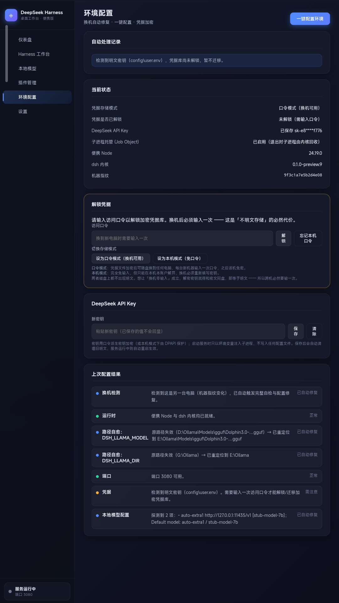
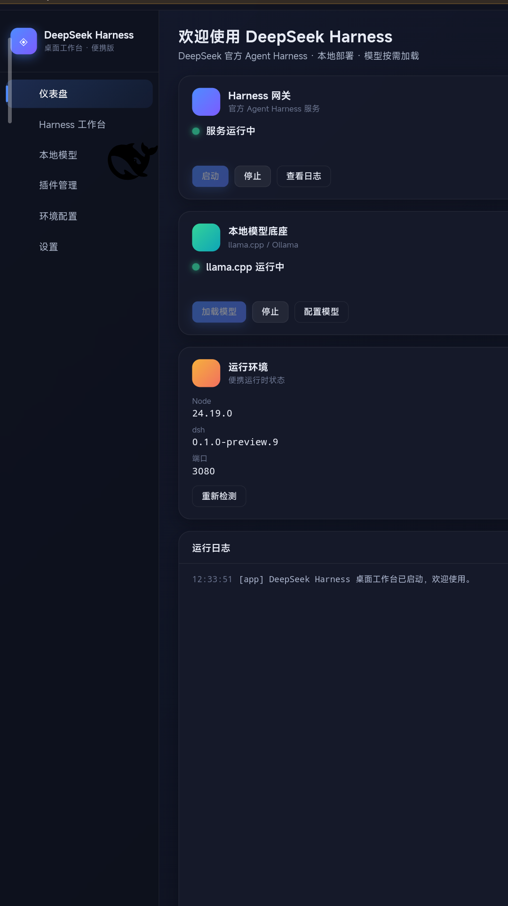

# DeepSeek Harness 桌面启动器

> 给 [DeepSeek Harness](https://github.com/deepseek-ai/deepseek-harness)（`dsh`）做的 Windows 便携启动器：
> 一键环境配置、换机路径自愈、凭据加密、进程树托管，并自动探测拉起本地模型服务。


---

## 它解决什么问题

`dsh` 本体是跨平台的插件化 Agent Harness，但**在 Windows 上做便携部署有几个硬伤**，
这个启动器就是为它们而生的：

| 痛点 | 本项目的做法 |
|---|---|
| 换台电脑，配置里写死的盘符全失效，表现只是"启动成功但没有本地模型" | **路径自愈**：按相对尾部在其它盘重新定位并写回配置 |
| API Key 明文躺在 `user.env` 和 `.credentials.yaml` 里，随 U 盘流动 | **加密凭据**：口令模式（PBKDF2 + AES-256-CBC + HMAC，可随盘换机）或本机 DPAPI 模式；只以环境变量注入子进程 |
| 关掉启动器后 `node` / `llama-server` / `ollama` 变成孤儿进程，继续占端口与显存 | **Job Object 托管**：退出时由内核回收整棵进程树 |
| 点一下"启动服务"，界面冻结最长 10 分钟 | 编排逻辑移出 UI 线程，改为后台执行 + 进度回报 |
| 本地模型端口不在探测表里，配置全链路互不报错地空转 | 显式端点声明 + 探测失败**不删除**已有 provider |

---

## 界面

**环境配置**（换机自检、一键配置、凭据解锁、逐步结果报告）



**仪表盘**（网关与模型状态、运行环境、实时日志）



> 截图为**演示模式**渲染（用内置示例数据，不连接真实后端），用于展示布局。

---

## 快速开始

1. 把整个部署目录放到任意位置（U 盘也行），双击 `DeepSeekHarness.exe`
2. 首次在新机器上：进 **环境配置** → 点 **一键配置环境**
3. 若提示需要口令 → 输入一次（之后该机器免密）
4. 回仪表盘 → **启动服务** → **打开 Web UI**

命令行备用入口：`start.bat`（行为与 exe 不完全等价，见 `HANDOVER.md` §6.2）。

---

## 核心能力

### 环境配置页

- **换机检测**：机器指纹（`MachineGuid` + 机器名 + 用户名 的 SHA-256）变化即触发完整自检
- **路径自愈**：模型按同名 `.gguf`、目录按 `Ollama`、可执行文件按 `llama-server.exe` / `ollama.exe` 在其它盘重新定位
- **一键配置**：运行时检查/部署 → 路径自愈 → 端口检查 → 凭据状态 → 驱动 `auto-config.mjs` 探测并生成 provider
- **结果可见**：每步状态（正常／已自动修复／需注意／失败）与说明都列出来，不吞错误

### 凭据加密

| 模式 | 换机可用 | 输入成本 | 实现 |
|---|---|---|---|
| **口令模式**（默认） | ✅ 凭据文件可随盘搬走 | 每台新机一次口令，之后免密 | PBKDF2-HMAC-SHA256（20 万次迭代）+ AES-256-CBC + HMAC-SHA256（encrypt-then-MAC） |
| 本机模式 | ❌ 仅本机本账户可解 | 零输入 | DPAPI（CurrentUser） |

密钥**只以环境变量注入 dsh 子进程，不写入任何配置文件** —— 依据是 `dsh-credentials-local`
的解析顺序 `env → .credentials.yaml → .env`（环境变量优先）。

> **为什么跨机必然要输一次口令**：若要让"换机零输入"成立，解密密钥就必须与密文同盘存放，
> 那与明文无异。这是约束，不是实现取舍。

### 进程托管

启动器把**自身**放进 Windows Job Object（`JOB_OBJECT_LIMIT_KILL_ON_JOB_CLOSE`），
之后派生的全部子进程自动继承 Job。这是 `taskkill /T /F` 覆盖不到的
（模型服务是已退出的 PowerShell 的子进程，不在 dsh 的进程树里）。

### 与 dsh 的分工

**DSH 已有的能力不重复实现，只对接**：provider 的细粒度管理用 dsh 自带的 Models 页面；
插件经 `dsh plugin --profile web add/remove` 安装；启动器只负责自动播种与生命周期。

---

## 构建

```powershell
cd src\launcher
powershell -NoProfile -ExecutionPolicy Bypass -File .\build.ps1
```

需要 .NET Framework 4.8 的 `csc.exe`（系统自带），产物为 `src\DeepSeekHarness.exe`。
**不需要** Visual Studio、.NET SDK 或管理员权限。

> ⚠️ 该 `csc.exe` 只支持 **C# 5**：不要用字符串插值、`?.`、表达式体成员、`out var` 等语法。
> ⚠️ 构建验收必须检查产物含 `PerMonitorV2`（缺了高 DPI 屏会发虚）。
> 详细步骤与坑见 **`HANDOVER.md`**。

---

## 项目结构

```
├── HANDOVER.md              给电脑端 AI 的交接说明（构建/配置/验证/回滚）
├── VERIFICATION.md          验证证据与「未验证」清单
├── OPTIMIZATION-REVIEW.md   代码审查报告（含实测复现的缺陷）
├── docs/screenshots/        界面截图
├── launcher/
│   ├── src/                 C# 源码（build.ps1 只编译这里）
│   ├── web/                 WebView2 界面（原生 HTML/CSS/JS，无框架）
│   └── legacy/              旧版单体实现，不参与编译，仅存档
├── scripts/                 auto-config.mjs / scan-missing.mjs / start-model-server.ps1
└── config/user.env.example  配置模板（刻意不写死盘符）
```

---

## 安全须知

1. **不要提交 `config/user.env`、`home/`、`config/secrets.*`** —— `.gitignore` 已覆盖
2. Windows 上 dsh 自身不做凭据文件权限校验（`dsh-credentials-local` 里有
   `if (process.platform === "win32") return;`），**不要依赖文件权限保护密钥**
3. 若历史明文密钥曾随盘流动过，请到 [platform.deepseek.com](https://platform.deepseek.com/) 轮换

---

## 相关

- 上游项目：[deepseek-ai/deepseek-harness](https://github.com/deepseek-ai/deepseek-harness)
- 本地推理：[llama.cpp](https://github.com/ggerganov/llama.cpp) · [Ollama](https://ollama.com/)
